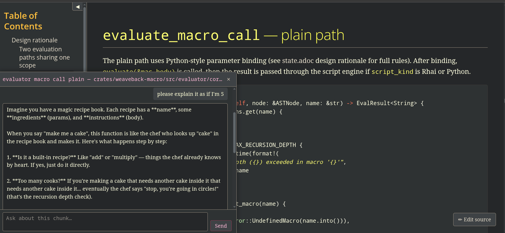

= Weaveback

link:https://giannifer7.github.io/weaveback/[Documentation]
| link:https://giannifer7.github.io/weaveback/crates/weaveback-tangle/src/weaveback_tangle.html[weaveback-tangle source]
| link:https://giannifer7.github.io/weaveback/crates/weaveback-macro/src/weaveback_macro.html#literate-sources[weaveback-macro source]

Weaveback is a bidirectional literate programming toolchain.

Write your source code inside AsciiDoc (or any text file), assemble named
chunks, and let the tool write the real files — then trace any generated
line back to its origin, or propagate edits back to the source.

[source,sh]
----
weaveback source.adoc --gen src
----

---

== What makes Weaveback different

Traditional literate programming is one-way: source → generated code.
Edits to generated files must be propagated back manually, and over time
the two representations drift.

Weaveback closes the loop.
Every generated line knows where it came from and can be traced precisely.
Edits can propagate back to the source.

- *Trace* any generated line back to its source: `weaveback where`
- *Propagate* edits from generated files back to the document: `weaveback apply-back`

The source remains the single source of truth — without becoming a dead end.

---

== A simple example

Start from generated code:

[source,rust]
----
// src/events.rs — generated
pub enum PluginEvent {
    PluginLoad,
    PluginUnload,
}
----

Trace a line back to its origin:

[source,sh]
----
weaveback where src/events.rs:2
----

→ opens the exact chunk in the literate source.

---

Or edit the generated file directly:

[source,rust]
----
// src/events.rs — after your edit
pub enum PluginEvent {
    PluginLoaded,
    PluginUnloaded,
}
----

Propagate the change back:

[source,sh]
----
weaveback apply-back
----

→ the literate source is updated, preserving consistency.

---

== Language-agnostic fan-out

A single document can define data once and fan it out to multiple files in
multiple languages simultaneously.

Add one entry; every target stays in sync.

The example below defines plugin events in AsciiDoc and generates
a C header, a Rust module, and a SQL seed file from the same source definition.

[source,adoc]
----
%def(event, id, ns, name, description, %{
// <[c enum arms]>=
EVT_%to_screaming_case(%(ns))_%to_screaming_case(%(name)) = %(id),
// @
// <[rust enum arms]>=
%to_pascal_case(%(ns))%to_pascal_case(%(name)),
// @
// <[sql rows]>=
INSERT INTO audit_event_types (id, name, description)
    VALUES (%(id), '%(ns).%(name)', '%(description)')
    ON CONFLICT (name) DO NOTHING;
// @
%})

%event(0, plugin, load,   "Plugin loaded into host")
%event(1, plugin, unload, "Plugin removed from host")
----

All outputs remain consistent because they originate from the same structured source.

---

== Macro language

The macro system is intentionally simple.

Built-ins — case conversion, `%if`, `%equal` — cover common patterns
while keeping expansions predictable and traceable.

Macros enable:
- parameterized code generation
- structured reuse
- multi-language fan-out

without introducing a full programming language.

---

== Escape hatches

When the built-in macros are not enough, two scripted extensions are available.

- *`%rhaidef`* — macro body is a https://rhai.rs[Rhai] script, compiled into the binary. No external runtime.
- *`%pydef`* — macro body runs in a sandboxed Python interpreter (monty), also compiled in. No Python installation required.

The tradeoff: code produced inside scripted macros cannot be mapped back by
`weaveback trace`. Use them for isolated calculations or string manipulation,
not as a primary structuring mechanism.

---

== Agent and IDE integration

Weaveback exposes a set of operations via MCP:

- *Source Tracing*: trace a generated line to its exact source chunk.
- *Semantic Intelligence*: "Go to Definition" and "Find References" using LSP (Rust, Nim, Python).
- *Literate Diagnostics*: see compiler errors and hover info directly in the source document.
- *Contextual Understanding*: retrieve full chunk context (code, prose, dependencies).
- *Verified Editing*: apply surgical, oracle-verified edits to source files.

This enables a workflow closer to:

trace → understand → modify → verify

rather than blind generation.

---

== Live documentation server

`weaveback serve` starts a local HTTP server with live reload, inline chunk
editing, and an AI assistant panel that receives full chunk context: source
body, surrounding prose and design notes, dependency bodies.

---

== Install

*Installer script* (Linux, macOS, Windows — downloads and installs the binary):

[source,sh]
----
python3 scripts/install.py             # core
python3 scripts/install.py --diagrams  # + PlantUML support
----

*Arch Linux:* `paru -S weaveback-bin`

*Nix:* `nix profile install github:giannifer7/weaveback`

*Quick binary only (musl, any Linux):*

[source,sh]
----
curl -sL https://github.com/giannifer7/weaveback/releases/latest/download/weaveback-musl \
     -o ~/.local/bin/weaveback && chmod +x ~/.local/bin/weaveback
----

→ link:docs/install.adoc[Full installation guide]

---

== Quick start

[source,sh]
----
cd examples/events
weaveback events.adoc --gen .
----

---

== Status

Experimental. This is an ongoing exploration of bidirectional literate
programming and structured agent integration.

Not production-ready. The focus is on the design, not completeness.

---

== Documentation

[cols="1,3",options="header"]
|===
| Document | Contents

| link:docs/cli.adoc[CLI reference]
| All flags and options

| link:docs/macros.adoc[Macro language]
| `%def`, `%if`, `%rhaidef`, `%pydef`

| link:docs/noweb.adoc[Chunk syntax]
| `@file`, named chunks, composition

| link:docs/tracing.adoc[Source tracing]
| `trace`, `apply-back`, MCP workflow

| link:docs/architecture.adoc[Architecture]
| Pipeline, source maps, server design

| link:docs/install.adoc[Installation]
| Platforms and binaries
|===

---

== License

0BSD OR MIT OR Apache-2.0
