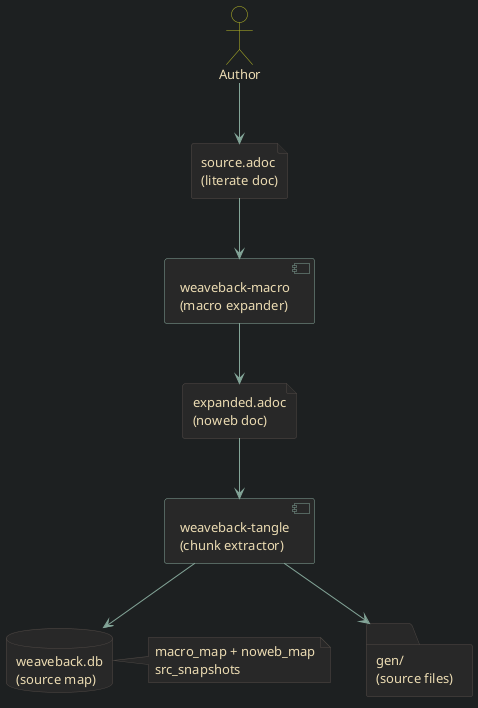

# Weaveback — project index

Weaveback is a literate-programming toolchain written in Rust. Source files
are authored as annotated documents (AsciiDoc or Markdown); weaveback expands
macro calls and extracts named code chunks to produce final source files.

This page is the top-level navigation hub. Every literate source in the
project is listed below with a short description. Generated HTML pages
also carry per-page module cross-reference data (imports, imported-by, public
symbols) rendered in the *Module cross-references* panel at the bottom of each
page.

## Overview

<!-- graph: Toolchain pipeline -->



The two core passes can run independently, or via the split front-end tools:

```shell
# Build/tangle directly
wb-tangle source.adoc --gen src/

# Separate passes
weaveback-macro source.adoc --output expanded.adoc
weaveback-tangle expanded.adoc --gen src/
```


## Crate overview

.Workspace crates
| Crate | Purpose |
| --- | --- |
| [weaveback-macro](../crates/weaveback-macro/src/weaveback_macro.adoc) | Macro expansion engine — lexer, parser, AST, evaluator, scripting back-ends |
| [weaveback-tangle](../crates/weaveback-tangle/src/weaveback_tangle.adoc) | Noweb chunk extractor, safe file writer, SQLite source-map database |
| [split CLI overview](../docs/cli.adoc) | Public command surface: `wb-tangle`, `wb-query`, `wb-serve`, and `wb-mcp` |
| [markup prelude](../docs/markup-prelude.adoc) | Currency-sign document macros for markup-portable code blocks, diagrams, links |
| [two-pass markup migration](../docs/two-pass-markup-migration.adoc) | Migration plan from direct `.adoc` sources to `.wvb` sources with AsciiDoc and Markdown projections |
| [weaveback-docgen](../crates/weaveback-docgen/src-wvb/weaveback_docgen.wvb) | Renders all `.adoc` to HTML with dark theme, PlantUML, Rust xref graph |
| [weaveback-core](../crates/weaveback-core/src-wvb/weaveback_core.wvb) | Shared constants, configuration, and path resolution logic |
| [weaveback-lsp](../crates/weaveback-lsp/src/weaveback_lsp.adoc) | Language Server Protocol (LSP) client for Rust, Nim, and Python |
| [weaveback Python agent bridge](../project/agent-python.adoc) | Literate design and scaffold for the PyO3 + Pydantic agent stack |

## Project-level literate sources

These documents generate workspace files and cross-cutting scaffolding outside
the main Rust crates.

.project adoc files
| Document | Generates |
| --- | --- |
| [root project files](../project/project.adoc) | `Cargo.toml`, `justfile`, `.gitignore`, `weaveback.toml`, and other root files |
| [Python agent bridge](../project/agent-python.adoc) | `crates/weaveback-agent-core/`, `crates/weaveback-py/`, and `python/` |
| [CLI option-spec experiment](../project/option-spec.adoc) | `scripts/option_spec/` prototype for multi-projection CLI metadata |
| [complexity reduction plan](../docs/complexity-reduction-plan.adoc) | Cleanup plan for reducing source/generated drift and oversized modules |
| [split CLI specification](../cli-spec/cli-spec.adoc) | `docs/cli.adoc` (generated cross-binary CLI reference) |

## Split CLI literate sources

The public CLI now lives in four focused binaries.

.split CLI adoc files
| Document | Generates |
| --- | --- |
| [wb-tangle](../crates/wb-tangle/src/main.adoc) | `crates/wb-tangle/src/main.rs` |
| [wb-query](../crates/wb-query/src/main.adoc) | `crates/wb-query/src/main.rs` |
| [wb-serve](../crates/wb-serve/src/main.adoc) | `crates/wb-serve/src/main.rs` |
| [wb-mcp](../crates/wb-mcp/src/main.adoc) | `crates/wb-mcp/src/main.rs` |

## Planning notes

Some project constraints and future directions are still exploratory. These
notes are meant to preserve them without pretending they are settled.

* [agent smoothness](agent-smoothness.adoc)
* [stability first](stability-first.adoc)
* [Python agent interface](python-agent-interface.adoc)
* [near-term engineering plan](roadmap.adoc)
* [complexity reduction plan](complexity-reduction-plan.adoc)
* [two-pass markup migration plan](two-pass-markup-migration.adoc)
* [weaveback-macro vs GNU m4](m4-comparison.adoc)
* [macro language critique prep](macro-language-critique-prep.adoc)
* [macro language tightening plan](macro-language-tightening-plan.adoc)
* [linter planning notes](linter-plan.adoc)
* [facts and rules for option specs](fact-rules-plan.adoc)

## weaveback-tangle literate sources

Start with [weaveback_tangle.adoc](../crates/weaveback-tangle/src/weaveback_tangle.adoc)
for the module map and error hierarchy, then follow the dependency order:
`noweb` → `safe_writer` → `db`. The CLI `main.rs` is the thin shell around `Clip`.

.weaveback-tangle adoc files
| Document | Generates |
| --- | --- |
| [weaveback-tangle crate index](../crates/weaveback-tangle/src/weaveback_tangle.adoc) | `crates/weaveback-tangle/src/lib.rs` |
| [chunk parser and expander](../crates/weaveback-tangle/src/noweb.adoc) | `crates/weaveback-tangle/src/noweb.rs` |
| [safe file writer](../crates/weaveback-tangle/src/safe_writer.adoc) | `crates/weaveback-tangle/src/safe_writer.rs` |
| [persistent database](../crates/weaveback-tangle/src/db.adoc) | `crates/weaveback-tangle/src/db.rs` |
| [CLI binary](../crates/weaveback-tangle/src/cli.adoc) | `crates/weaveback-tangle/src/main.rs` |
| [tests](../crates/weaveback-tangle/src/tests/tests.adoc) | `crates/weaveback-tangle/src/tests/` (4 files) |
| [Cargo manifest](../crates/weaveback-tangle/manifest.adoc) | `crates/weaveback-tangle/Cargo.toml` |

## weaveback-macro literate sources

.weaveback-macro adoc files
<table>
  <tr><th>Document</th><th>Generates</th></tr>
  <tr><td>[weaveback-macro crate index](../crates/weaveback-macro/src/weaveback_macro.adoc)</td><td>`crates/weaveback-macro/src/lib.rs`</td></tr>
  <tr><td>[shared types](../crates/weaveback-macro/src/types.adoc)</td><td>`crates/weaveback-macro/src/types.rs`</td></tr>
  <tr><td>[line index](../crates/weaveback-macro/src-wvb/line_index.wvb)</td><td>`crates/weaveback-macro/src/line_index.rs`</td></tr>
  <tr><td>[lexer](../crates/weaveback-macro/src/lexer/lexer.adoc)</td><td>`crates/weaveback-macro/src/lexer/mod.rs` +<br>
`crates/weaveback-macro/src/lexer/tests.rs`</td></tr>
  <tr><td>[parser](../crates/weaveback-macro/src/parser/parser.adoc)</td><td>`crates/weaveback-macro/src/parser/mod.rs`</td></tr>
  <tr><td>[AST](../crates/weaveback-macro/src/ast/ast.adoc)</td><td>`crates/weaveback-macro/src/ast/mod.rs` +<br>
`crates/weaveback-macro/src/ast/serialization.rs` +<br>
`crates/weaveback-macro/src/ast/tests.rs`</td></tr>
  <tr><td>[evaluator index](../crates/weaveback-macro/src/evaluator/evaluator.adoc)</td><td>`crates/weaveback-macro/src/evaluator/mod.rs` +<br>
`crates/weaveback-macro/src/evaluator/errors.rs` +<br>
`crates/weaveback-macro/src/evaluator/lexer_parser.rs`</td></tr>
  <tr><td>[evaluator state](../crates/weaveback-macro/src/evaluator/state.adoc)</td><td>`crates/weaveback-macro/src/evaluator/state.rs`</td></tr>
  <tr><td>[evaluator output sinks](../crates/weaveback-macro/src/evaluator/output.adoc)</td><td>`crates/weaveback-macro/src/evaluator/output.rs`</td></tr>
  <tr><td>[evaluator core](../crates/weaveback-macro/src/evaluator/core.adoc)</td><td>`crates/weaveback-macro/src/evaluator/core.rs`</td></tr>
  <tr><td>[evaluator builtins](../crates/weaveback-macro/src/evaluator/builtins.adoc)</td><td>`crates/weaveback-macro/src/evaluator/builtins.rs` +<br>
`crates/weaveback-macro/src/evaluator/case_conversion.rs` +<br>
`crates/weaveback-macro/src/evaluator/source_utils.rs`</td></tr>
  <tr><td>[script back-ends](../crates/weaveback-macro/src/evaluator/scripting.adoc)</td><td>`crates/weaveback-macro/src/evaluator/monty_eval.rs`</td></tr>
  <tr><td>[public eval API](../crates/weaveback-macro/src/evaluator/eval_api.adoc)</td><td>`crates/weaveback-macro/src/evaluator/eval_api.rs`</td></tr>
  <tr><td>[evaluator tests index](../crates/weaveback-macro/src/evaluator/tests.adoc) +<br>
[tests-macros](../crates/weaveback-macro/src/evaluator/tests-macros.adoc) +<br>
[tests-control](../crates/weaveback-macro/src/evaluator/tests-control.adoc) +<br>
[tests-case](../crates/weaveback-macro/src/evaluator/tests-case.adoc) +<br>
[tests-scripting](../crates/weaveback-macro/src/evaluator/tests-scripting.adoc) +<br>
[tests-output](../crates/weaveback-macro/src/evaluator/tests-output.adoc)</td><td>`crates/weaveback-macro/src/evaluator/tests/` (21 files)</td></tr>
  <tr><td>[macro_api](../crates/weaveback-macro/src/macro_api.adoc)</td><td>`crates/weaveback-macro/src/macro_api.rs`</td></tr>
  <tr><td>[CLI binary](../crates/weaveback-macro/src/bin/cli.adoc)</td><td>`crates/weaveback-macro/src/bin/weaveback-macro.rs`</td></tr>
  <tr><td>[Cargo manifest](../crates/weaveback-macro/manifest.adoc)</td><td>`crates/weaveback-macro/Cargo.toml`</td></tr>
</table>

## weaveback-core literate sources

.weaveback-core adoc files
| Document | Generates |
| --- | --- |
| [weaveback-core index](../crates/weaveback-core/src-wvb/weaveback_core.wvb) | `crates/weaveback-core/src/lib.rs` |
| [Cargo manifest](../crates/weaveback-core/manifest.adoc) | `crates/weaveback-core/Cargo.toml` |

## weaveback-lsp literate sources

.weaveback-lsp adoc files
| Document | Generates |
| --- | --- |
| [weaveback-lsp index](../crates/weaveback-lsp/src/weaveback_lsp.adoc) | `crates/weaveback-lsp/src/lib.rs` |
| [Cargo manifest](../crates/weaveback-lsp/manifest.adoc) | `crates/weaveback-lsp/Cargo.toml` |

## weaveback-docgen literate sources

Renders `.adoc` files to dark-themed HTML with PlantUML diagrams, literate chunk IDs,
and cross-reference panels.

.weaveback-docgen adoc files
| Document | Generates |
| --- | --- |
| [weaveback-docgen index](../crates/weaveback-docgen/src-wvb/weaveback_docgen.wvb) | `crates/weaveback-docgen/src/main.rs` + `lib.rs` |
| [acdc renderer](../crates/weaveback-docgen/src-wvb/render.wvb) | `crates/weaveback-docgen/src/render.rs` |
| [HTML post-processor](../crates/weaveback-docgen/src-wvb/inject.wvb) | `crates/weaveback-docgen/src/inject.rs` |
| [cross-reference engine](../crates/weaveback-docgen/src-wvb/xref.wvb) | `crates/weaveback-docgen/src/xref.rs` |
| [literate index builder](../crates/weaveback-docgen/src-wvb/literate_index.wvb) | `crates/weaveback-docgen/src/literate_index.rs` |
| [PlantUML integration](../crates/weaveback-docgen/src-wvb/plantuml.wvb) | `crates/weaveback-docgen/src/plantuml.rs` |
| [Cargo manifest](../crates/weaveback-docgen/manifest.adoc) | `crates/weaveback-docgen/Cargo.toml` |

## Project configuration

Root-level project files — workspace manifest, justfile, tangle config, toolchain pin,
and editor/IDE settings — all generated from a single literate source.

.Project configuration adoc files
<table>
  <tr><th>Document</th><th>Generates</th></tr>
  <tr><td>[project.adoc](../project/project.adoc)</td><td>`Cargo.toml`, `justfile`, `weaveback.toml`, `.gitignore`, `rust-toolchain.toml`,<br>
`.mcp.json`, `.vscode/settings.json`, `Containerfile`, `flake.nix` (snapshot)</td></tr>
  <tr><td>[workflows.adoc](../.github/workflows/workflows.adoc)</td><td>`.github/workflows/ci.yml`, `pages.yml`, `release.yml`</td></tr>
</table>

## Packaging and distribution

.Packaging adoc files
| Document | Generates |
| --- | --- |
| [packaging.adoc](../packaging/packaging.adoc) | `packaging/update_release.py` — downloads release assets, writes AUR PKGBUILD and `flake.nix` |

## Scripts and UI

.Scripts adoc files
<table>
  <tr><th>Document</th><th>Generates</th></tr>
  <tr><td>[scripts.adoc](../scripts/scripts.adoc)</td><td>`scripts/install.py`, `scripts/gliner_experiment.py`,<br>
`scripts/weaveback-graph/` Python package</td></tr>
  <tr><td>[serve-ui.adoc](../scripts/serve-ui/serve-ui.adoc)</td><td>TypeScript/CSS browser UI for the `wb-serve` documentation server<br>
(`src/`, `package.json`, `tsconfig.json`)</td></tr>
</table>

## Examples

Each example sub-project has a `config.adoc` capturing its build and tooling files.

.Example adoc files
| Document | Generates |
| --- | --- |
| [events/config.adoc](../examples/events/config.adoc) | `examples/events/justfile`, `meson.build`, `.gitignore` |
| [hello-world/config.adoc](../examples/hello-world/config.adoc) | `examples/hello-world/justfile`, `.gitignore` |
| [c_enum/config.adoc](../examples/c_enum/config.adoc) | `examples/c_enum/.gitignore` |
| [nim-adoc/config.adoc](../examples/nim-adoc/config.adoc) | `examples/nim-adoc/meson.build`, `.gitignore` |
| [nim-adoc/scripts/gen_docs.adoc](../examples/nim-adoc/scripts/gen_docs.adoc) | `examples/nim-adoc/scripts/gen_docs.py` |
| [graph-prototype/config.adoc](../examples/graph-prototype/config.adoc) | `examples/graph-prototype/Cargo.toml` |

## Platform tooling and test fixtures

.Platform tooling adoc files
| Document | Generates |
| --- | --- |
| [windows.adoc](../windows/windows.adoc) | `windows/verify.ps1`, `windows/verification.wsb` — Windows sandbox verification scripts |
| [test-data.adoc](../test-data/test-data.adoc) | `test-data/test-c-project/Taskfile` — test fixture for the C project integration tests |

## Architecture and design

*New here?* Start with [why.adoc](why.adoc) — the intent, tradeoffs, and
design rationale behind every major decision. Then read
[architecture.adoc](architecture.adoc) for the structural detail.

See [architecture.adoc](architecture.adoc) for a detailed discussion of:

* The literate-programming model and toolchain pipeline
* [Backpropagation (`apply-back`](architecture.adoc#_propagating_gen_edits_back_to_the_source_apply_back) tool design)
* [MCP server interface and agent tools](architecture.adoc#_mcp_server_wb_mcp)
* [Semantic LSP bridge](architecture.adoc#_semantic_language_server_integration_wb_query_lsp)
* [Macro tracing and the source-map schema](architecture.adoc#_source_tracing_wb_query_trace)
* Build-system integration (`--depfile`, `--stamp`)
