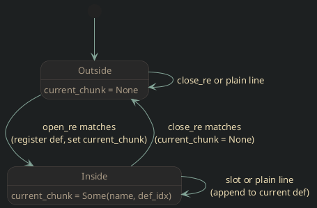

# Noweb Chunk Store Read

ChunkStore state, construction, source ingestion, and chunk definition parsing.

### Struct

```rust
// <[noweb-chunkstore-struct]>=
pub struct ChunkStore {
    chunks: HashMap<String, NamedChunk>,
    file_chunks: Vec<String>,
    syntax: NowebSyntax,
    file_names: Vec<String>,
    /// When `true`, referencing an undefined chunk is a fatal error
    /// and `@file` redefinition without `@replace` is also a fatal error.
    /// Default `false`: undefined chunks expand to nothing; redefinitions warn.
    pub strict_undefined: bool,
    /// When `true`, emit warnings about chunks that are defined but never
    /// referenced by any `@file` chunk (directly or transitively).
    /// Default `false`: unused-chunk warnings are suppressed.
    pub warn_unused: bool,
    /// Errors accumulated during `read()` that are promoted to hard errors
    /// when `strict_undefined` is `true`.  Checked by `Clip::write_files`.
    pub parse_errors: Vec<ChunkError>,
}
// @
```


### Constructor

`NowebSyntax::new` compiles the three regexes that encode the full delimiter
grammar, and `ChunkStore` holds one `NowebSyntax` so the same matcher can be
reused by other tools such as `lint`.

* The _open pattern_ matches chunk-definition headers: an optional comment
  prefix, the open delimiter, optional `@replace` and `@file` modifiers
  captured as named groups so they can be detected structurally rather than by
  scanning the whole line, the chunk name, and a `=` suffix.
* The _slot pattern_ matches chunk references inside body lines: an optional
  comment prefix, the open delimiter, zero or more prefixed reference options
  (`@file`, `@reversed`, `@compact`, `@tight`) captured as one group, the chunk
  name, and the close delimiter.
* The _close pattern_ matches chunk-end markers: an optional comment prefix
  followed by the chunk-end string (default `@`).

```rust
// <[noweb-chunkstore-new]>=
impl ChunkStore {
    pub fn new(
        open_delim: &str,
        close_delim: &str,
        chunk_end: &str,
        comment_markers: &[String],
    ) -> Self {
        Self {
            chunks: HashMap::new(),
            file_chunks: Vec::new(),
            syntax: NowebSyntax::new(open_delim, close_delim, chunk_end, comment_markers),
            file_names: Vec::new(),
            strict_undefined: false,
            warn_unused: false,
            parse_errors: Vec::new(),
        }
    }

    pub fn add_file_name(&mut self, fname: &str) -> usize {
        let idx = self.file_names.len();
        self.file_names.push(fname.to_string());
        idx
    }

    fn validate_chunk_name(&self, chunk_name: &str, is_file: bool) -> bool {
        if is_file {
            let path = chunk_name.strip_prefix("@file ").unwrap_or(chunk_name);
            path_is_safe(path).is_ok()
        } else {
            !chunk_name.is_empty()
        }
    }
}
// @
```


### Read loop

`read` scans a source text line-by-line, maintaining a simple three-state
machine:

<!-- graph: noweb-read-loop -->



`@file` chunks are registered in `file_chunks` on first appearance.  Duplicate
`@file` definitions without `@replace` are pushed to `parse_errors` in strict
mode (fatal when `write_files` is called) or reported to stderr and skipped in
permissive mode, keeping the first definition rather than silently clobbering it.

```rust
// <[noweb-chunkstore-read]>=
impl ChunkStore {
    pub fn read(&mut self, text: &str, file_idx: usize) {
        debug!("Reading text for file_idx: {}", file_idx);
        let mut current_chunk: Option<(String, usize)> = None;

        for (line_no, line) in text.lines().enumerate() {
            if self.syntax.parse_definition_line(line).is_none() {
                // No open delimiter — can only be a close marker or content.
                if self.syntax.is_close_line(line) {
                    if let Some((ref cname, idx)) = current_chunk
                        && let Some(chunk) = self.chunks.get_mut(cname)
                        && let Some(def) = chunk.definitions.get_mut(idx)
                    {
                        def.def_end = Some(line_no);
                    }
                    current_chunk = None;
                } else if let Some((ref cname, idx)) = current_chunk
                    && let Some(chunk) = self.chunks.get_mut(cname)
                {
                    let def = chunk.definitions.get_mut(idx)
                        .expect("internal invariant: def_idx is valid");
                    if line.ends_with('\n') {
                        def.content.push(line.to_string());
                    } else {
                        def.content.push(format!("{}\n", line));
                    }
                }
                continue;
            }
            if let Some(def_match) = self.syntax.parse_definition_line(line) {
                debug!(
                    "Found open pattern: indentation='{}', base_name='{}'",
                    def_match.indent_len, def_match.base_name
                );

                let full_name = if def_match.is_file {
                    format!("@file {}", def_match.base_name)
                } else {
                    def_match.base_name
                };

                if self.validate_chunk_name(&full_name, def_match.is_file) {
                    if full_name.starts_with("@file ") {
                        if self.chunks.contains_key(&full_name) && !def_match.is_replace {
                            let location = ChunkLocation { file_idx, line: line_no };
                            let err = ChunkError::FileChunkRedefinition {
                                file_chunk: full_name.clone(),
                                file_name: self
                                    .file_names
                                    .get(file_idx)
                                    .cloned()
                                    .unwrap_or_default(),
                                location,
                            };
                            if self.strict_undefined {
                                self.parse_errors.push(err);
                            } else {
                                eprintln!("{}", err);
                            }
                            continue;
                        }
                        if def_match.is_replace {
                            self.chunks.remove(&full_name);
                        }
                    } else if def_match.is_replace {
                        self.chunks.remove(&full_name);
                    }

                    let chunk = self
                        .chunks
                        .entry(full_name.clone())
                        .or_insert_with(NamedChunk::new);
                    let def_idx = chunk.definitions.len();
                    chunk.definitions.push(ChunkDef::new(
                        def_match.indent_len,
                        file_idx,
                        line_no,
                    ));

                    current_chunk = Some((full_name.clone(), def_idx));
                    if full_name.starts_with("@file ") && !self.file_chunks.contains(&full_name) {
                        self.file_chunks.push(full_name.clone());
                    }
                    debug!("Started chunk: {}", full_name);
                }
                continue;
            }

            if self.syntax.is_close_line(line) {
                if let Some((ref cname, idx)) = current_chunk
                    && let Some(chunk) = self.chunks.get_mut(cname)
                    && let Some(def) = chunk.definitions.get_mut(idx)
                {
                    def.def_end = Some(line_no);
                }
                current_chunk = None;
                continue;
            }

            if let Some((ref cname, idx)) = current_chunk
                && let Some(chunk) = self.chunks.get_mut(cname)
            {
                let def = chunk.definitions.get_mut(idx)
                    .expect("internal invariant: def_idx is valid");
                if line.ends_with('\n') {
                    def.content.push(line.to_string());
                } else {
                    def.content.push(format!("{}\n", line));
                }
            }
        }

        debug!("Finished reading. File chunks: {:?}", self.file_chunks);
    }
}
// @
```

